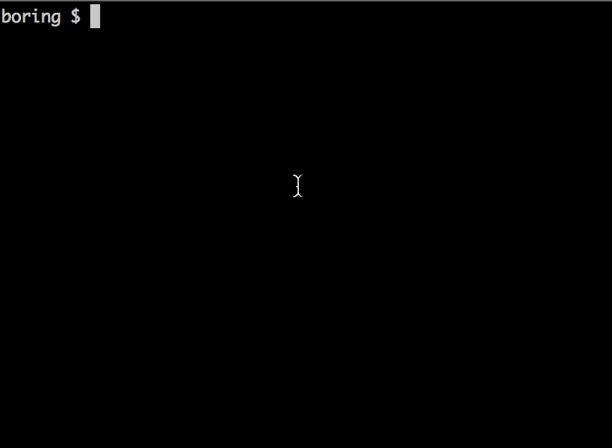

My dot files
========================
[](https://saythanks.io/to/fatso83)

These are my config files for Bash, VIM, Python, tmux and more. Also includes a handful of [utility scripts](./utils/scripts) 
and quite a lot of [aliases/functions](https://github.com/fatso83/dotfiles/blob/master/common-setup/bash.d/bash_aliases_functions) I find useful and re-use quite often.

You may use them as they are, fork the repo, copy-paste what you like or suggest changes. It's under a do as you please license :)

## Intentionally simple
I really hate code or configuration that I don't understand. It might do magical things, but when things ago awry, and they do, I need to be able to fix it. In this setup, I have handwritten (or at least hand copied :smiley:) every line, and I have tried to document (commit msg or inline comment) why the line exists if it is scary or weird in some way. I encourage you to read the various setup files to understand how it works and prod around yourself :)

## Installation

```
git clone https://github.com/fatso83/dotfiles
./dotfiles/setup.sh # and wait until completion ...
```

The first time you run the install it will take some time, mostly due [YouCompleteMe](https://github.com/Valloric/YouCompleteMe), which needs to be downloaded and compiled. It might seem as if the install hangs on this step, but this only takes a lot of time the first time you run setup. On subsequent `./setup.sh` runs, it should not take more than a second or two.

## Per machine settings

_Which_ programs to install and _how_ is of course unique to every operating system. This setup supports this quite fine, so I can get my tools, no matter if macOS or WSL2. Some of the common setup uses environment switches to handle BSD vs GNU issues and such.

See [`per-host-config/README.md`](./per-host-config/README.md)
